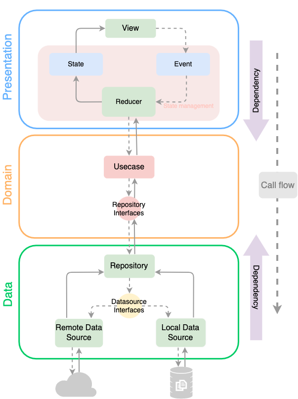

# TODO: Clean Architecture for Vanilla

- [Clean architecture](https://blog.cleancoder.com/uncle-bob/2012/08/13/the-clean-architecture.html) to improve productivity across all projects.
  - It is framework agnostic so can apply across all projects.
  - Helps to improve team productivity by separating responsibilities.
- Readable code to improve maintainability.
  - Readable code saves future developers time and effort.
    Code readability is key for large software projects with many developers, and where the source code that is being written will have to be modified by another person.
  - Usually, readable code leads to a good implementation of the user's requirements and makes it easier to tune performance.

## Blueprint

- Web Component based SPA.
- Lazyload at routing.
- Clean Architecture.
- Atomic design.
- ...



## Directory structure

```sh
├── docs
├── scripts
└── src
    ├── app
    │   ├── assets
    │   ├── core
    │   └── features
    │       │
    │       │
    │       ├── data
    │       │   ├── datasources
    │       │   └── repositories
    │       ├── domain
    │       │   ├── entities
    │       │   ├── interfaces
    │       │   └── usecases
    │       └── presentation
    │           ├── screens
    │           └── shared
    │
    ├── mock
    │   ├── data
    │   └── server
    └── test
```

## Setup

- Clone repository

  ```sh
  git clone git@github.com:andres-oshiro/clean-frontend-vanilla.git
  ```

- Change directory

  ```sh
  cd clean-frontend-vanilla
  ```

- Execute setup shell
  - Mac users

    ```sh
    ./scripts/initial-setup.sh
    ```

  - Windows users

    ```sh
    ./scripts/initial-setup.ps1
    ```

## Quick start
